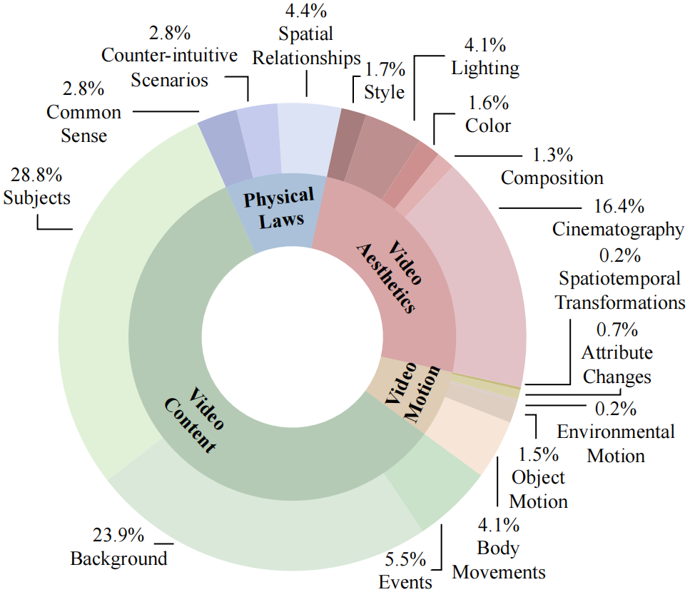
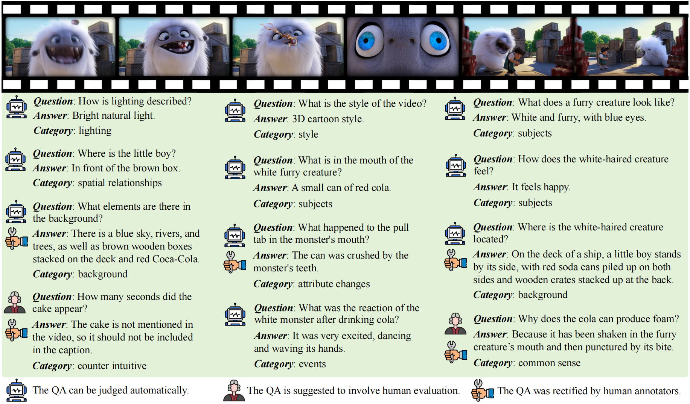

# VidCapBench: A Comprehensive Benchmark of Video Captioning for Controllable Text-to-Video Generation

## Overview
VidCapBench is the first evaluation benchmark designed for assessing video captions in controllable text-to-video (T2V) generation. 

To cate for T2V, we have made the following endeavers in data curation:

* ***Diverse videos.*** Besides collecting videos from open-source datasets, we also use videos from YouTube and user-generated content (UGC) paltforms to ensure a portion of our data remains unexposed to prior training or processing. When collecting videos, we pay much attention to the diversity, resulting in various subject categories

<p align="center">
    
</p>

VidCapBench evaluate captioning models in four dimensions: Video Aesthetics, Video Content, Video Motion, and Physical Laws, which align with the key metrics of T2V generation.

<p align="center">
    
</p>

<p align="center">
    
</p>

## Evaluation
First, you have to utilize your captioning models to generate captions for the videos, and save the captions in JSONL format, following this structure:
```
{"question": "Describe the video in detail.", "video": "Tarsier_20.mp4", "model_generation": Caption}
```

AE HE

code
