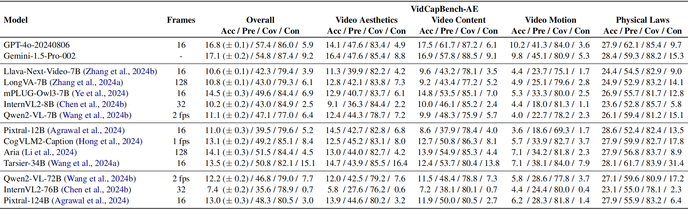

# VidCapBench: A Comprehensive Benchmark of Video Captioning for Controllable Text-to-Video Generation

## 🚀 Overview
VidCapBench is the first evaluation benchmark designed to assess the quality of video captions for controllable text-to-video (T2V) generation. Our goal is to establish a diverse and robust benchmark to evaluate captioning models and guide the development of high-quality T2V systems.

To achieve this, we have made the following endeavors in data curation:

* ***Diverse Video Collection.*** Beyond leveraging open-source datasets, we have incorporated videos from YouTube and user-generated content (UGC) platforms to ensure a portion of our data remains unexposed to prior training or processing. Our collection emphasizes diversity across multiple dimensions, including subject categories, art styles, subject quantities, and video lengths.

<p align="center">
    
</p>

* ***Comprehensive QA pairs aligned with T2V evaluation.*** VidCapBench evaluates captioning models across four critical dimensions: Video Aesthetics, Video Content, Video Motion, and Physical Laws, which align with the key metrics of T2V generation. The QA pairs are initially generated by GPT-4o and expert classifiers, followed by a rigorous manual revision to the unsuitable ones and additional annotation to address any imbalances in dimensions.

    Through analysis, we find that in the predefined-QA evaluation paradigm, certain QA pairs resist reliable automated evaluation due to inconsistencies in repetitive machine evaluations. To address this, we split the QA pairs in VidCapBench into two subsets:
  * **VidCapBench-AE** , QA pairs that receive consistent machine assessments, making them suitable for automated evaluation.
  * **VidCapBench-HE** , more challenging QA pairs that require human evaluation for nuanced differentiation.

<p align="center">
    
</p>

* ***Training-free T2V verification.*** We have conducted training-free T2V verification to demonstrate the significant positive correlation between scores on VidCapBench and T2V quality metrics, highlighting that VidCapBench can provide valuable guidance for training T2V models. We provide a qualitive illustration below. In this case, the video is associated with nine QA pairs in VidCapBench-AE  and four QA pairs in VidCapBench-HE . The similarity between the generated video and the original video, as well as the overall generation quality, are strongly correlated with the evaluation results in VidCapBench. Among the captioning models compared, Gemini exhibits the best performance. 
<p align="center">
    
</p>

## 🛠️ Evaluation Pipeline
To evaluate your captioning models on VidCapBench, please follow these steps:
1. Clone this repo.
```
git clone https://github.com/VidCapBench/VidCapBench.git
cd ./VidCapBench
```

2. Download the videos and QA files at [🤗VidCapBench](https://huggingface.co/datasets/VidCapBench/VidCapBench)

3. Use your captioning model to generate captions for the videos in VidCapBench, and save the generated captions in JSONL format, adhering to the following structure:
```
{"question": "Describe the video in detail.", "video": "videos_qa_80.mp4", "model_generation": Caption}
```
4. Execute the evaluation script with your generated captions:
```
python eval.py --caption_path /path_to/caption.jsonl --qa_path /path_to/VidCapBench-AE.jsonl
```
You can use your own API key for GPT-4o evaluation by editing the code [here](./eval.py#L24).

## 📈 Experimental Results

<p align="center">
    
</p>


## 🪪 License
```
VidCapBench is intended solely for academic research purposes, and any form of commercial use is strictly prohibited. 
The copyright of all videos belongs to the video owners.
If there is any infringement in VidCapBench, please email vidcapbench@gmail.com and we will remove it immediately.
Without prior authorization, you are not permitted to distribute, publish, copy, disseminate, or modify any part of VidCapBench. 
Compliance with these restrictions is mandatory.
```
